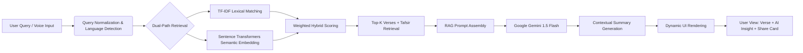

# 📖 AL-BAYAN | AI-Powered Quranic Verse Search Engine
> *Bridging Traditional Keyword Search with Semantic AI Understanding*

[](https://www.python.org/)
[](https://flask.palletsprojects.com/)
[](LICENSE)
[]()

**AL-BAYAN** is an AI-driven Quranic search engine developed as a Final Year Project (FYP). It transcends rigid exact-match searches by leveraging **Hybrid Information Retrieval** (`TF-IDF` + `Semantic Embeddings`) and **Retrieval-Augmented Generation (RAG)** to deliver context-aware, multi-lingual, and scholarly verse retrieval. Designed for students, researchers, and educators, it provides a modern, accessible, and ethically guided platform for Quranic exploration.

---

## 📑 Table of Contents
1. [Abstract & Overview](#abstract--overview)
2. [Project Objectives](#-project-objectives)
3. [Key Features](#-key-features)
4. [Technology Stack](#-technology-stack)
5. [System Architecture & Workflow](#-system-architecture--workflow)
6. [Project Structure](#-project-structure)
7. [Installation & Setup](#-installation--setup)
8. [Usage Guide](#-usage-guide)
9. [Dataset & Preprocessing Pipeline](#-dataset--preprocessing-pipeline)
10. [Evaluation & Testing (FYP)](#-evaluation--testing-fyp)
11. [Limitations & Future Work](#-limitations--future-work)
12. [Screenshots & UI Preview](#-screenshots--ui-preview)
13. [Ethical Guidelines & Academic Disclaimer](#-ethical-guidelines--academic-disclaimer)
14. [License](#-license)
15. [Acknowledgments](#-acknowledgments)
16. [Author & Contact](#-author--contact)
17. [Citation](#-citation)

---

## 📘 Abstract & Overview
Traditional Quranic search tools rely heavily on exact keyword matching, often missing thematic, contextual, or semantic connections between verses. **AL-BAYAN** addresses this gap by integrating:
- 🔍 **Hybrid Search**: Combines lexical precision (`TF-IDF`) with semantic understanding (`Sentence Transformers`).
- 🤖 **RAG Pipeline**: Retrieves top-matching verses + Tafsir excerpts, then feeds them to **Google Gemini 1.5 Flash** to generate contextual, scholarly summaries.
- 🌍 **Multi-lingual Interface**: Supports Arabic, English (Sahih International), and Urdu with real-time toggling.
- 🎙️ **Voice & Accessibility Features**: Hands-free search, adjustable typography, dark/light modes, and shareable verse cards.

This system is built as a demonstrable academic prototype, emphasizing reproducibility, ethical AI usage, and scholarly accuracy.

---

## 🎯 Project Objectives
| Objective | Implementation |
|:---|:---|
| **Semantic Understanding** | Vector embeddings (`all-MiniLM-L6-v2`) capture contextual meaning beyond exact keywords |
| **Multi-Language Retrieval** | Unified JSON dataset with parallel Arabic, English, and Urdu translations |
| **AI-Augmented Insights** | RAG pipeline with Gemini 1.5 Flash for contextual explanations & thematic summaries |
| **Modern Web Interface** | Responsive UI built with Tailwind CSS, Vanilla JS, and Flask templating |
| **Academic Reproducibility** | Clear dataset pipeline, preprocessing scripts, and modular architecture |

---

## ✨ Key Features
| Feature | Description |
|:---|:---|
| 🔄 **Hybrid Search Engine** | Weighted fusion of `TF-IDF` (lexical) + `Cosine Similarity` (semantic) for high precision & recall |
| 🧠 **AI-Powered Insights (RAG)** | Top-k verses + Tafsir excerpts → LLM prompt → contextual, scholarly summary generation |
| 🌐 **Tri-Lingual Support** | Seamless toggle between Arabic, English (Sahih Int.), and Urdu translations |
| 🎙️ **Voice-Activated Search** | Web Speech API integration for hands-free verse discovery |
| ⚙️ **Smart UI Controls** | Dark/light mode, dynamic font scaling, translation switching without reloads |
| 📤 **Shareable Verse Cards** | Auto-generated, social-media-ready verse images with metadata & attribution |
| 📖 **Surah/Ayah Navigator** | Structured browsing interface for systematic Quranic study |

---

## 🛠️ Technology Stack
| Layer | Technologies & Libraries |
|:---|:---|
| **Backend** | `Python 3.10+`, `Flask`, `Gunicorn` (deployment) |
| **AI / ML** | `PyTorch`, `Sentence-Transformers` (`all-MiniLM-L6-v2`), `Scikit-learn` (`TfidfVectorizer`) |
| **LLM Integration** | `Google GenAI SDK` (Gemini 1.5 Flash) |
| **Frontend** | `HTML5`, `Tailwind CSS`, `Vanilla JavaScript`, `Web Speech API` |
| **Data Pipeline** | Custom JSON merging scripts, runtime dataset consolidation, embedding precomputation |
| **DevOps** | `.env` configuration, virtual environments, modular script architecture |

---

## 🧠 System Architecture & Workflow

**Pipeline Breakdown:**
1. **Input Processing**: Query is cleaned, lowercased (for English/Urdu), and language-detected.
2. **Hybrid Retrieval**: 
   - `TF-IDF` scores exact keyword frequency & document rarity.
   - `Sentence Transformers` computes cosine similarity between query & verse embeddings.
   - Results are fused using a configurable weighted scoring formula:  
     `Final_Score = α·TF-IDF + (1-α)·Cosine_Similarity`
3. **RAG Generation**: Top-matching verses + relevant Tafsir Ibn Kathir excerpts are formatted into a structured prompt.
4. **LLM Response**: Gemini 1.5 Flash generates scholarly, context-aware summaries with strict hallucination guards.
5. **Frontend Delivery**: Results are injected dynamically with translation toggles, typography controls, and export functionality.

---

## 📂 Project Structure
```
AL-BAYAN/
│
├── app.py                      # Main Flask server, routing & runtime data merging
├── search_engine.py            # Hybrid search logic, RAG pipeline & prompt templates
├── models.py                   # Embedding model initialization & TF-IDF vectorizer
├── utils.py                    # Text cleaning, normalization & helper functions
├── cli.py                      # Optional command-line search interface
│
├── requirements.txt            # Python dependencies
├── .gitignore                  # Version control exclusions
├── README.md                   # Main documentation
│
├── templates/                  # Jinja2 HTML templates
│   ├── base.html               # Layout, navigation & UI components
│   ├── index.html              # Landing page & search entry
│   ├── search.html             # Results display & AI insights
│   ├── browse.html             # Surah/Ayah structured navigator
│   └── about.html              # Project documentation & credits
│
├── static/                     # Frontend assets
│   ├── css/styles.css          # Custom Tailwind overrides
│   ├── js/main.js              # Client-side interactivity & voice API
│   └── assets/                 # Screenshots & media
│
├── data/                       # Quranic & Tafsir datasets
│   ├── quran_part_1.json       # Surah 1–57
│   ├── quran_part_2.json       # Surah 58–114
│   └── sources/                # Raw/backup source files
│
└── scripts/                    # Data preprocessing & embedding scripts
    ├── merge_english_urdu.py   # Bilingual dataset merger
    ├── merge_tafseer.py        # Tafsir integration script
    ├── final_merge.py          # Final dataset consolidation
    └── precompute_embeddings.py # Vector embedding generator
```
> 💡 **Note:** The dataset is split to comply with GitHub's 25 MB file limit. `app.py` merges parts dynamically at runtime. Precomputed embeddings can be cached for faster local execution.

---

## ⚙️ Installation & Setup
### 1️⃣ Clone the Repository
```bash
git clone https://github.com/mohd-ali10/AL-BAYAN.git
cd AL-BAYAN
```

### 2️⃣ Create & Activate Virtual Environment
```bash
python -m venv venv
source venv/bin/activate   # macOS/Linux
venv\Scripts\activate      # Windows
```

### 3️⃣ Install Dependencies
```bash
pip install -r requirements.txt
```

### 4️⃣ Configure Google Gemini API Key
- Obtain your key from [Google AI Studio](https://aistudio.google.com/).
- Set as environment variable (recommended for security):
  ```bash
  export GEMINI_API_KEY="your_api_key_here"  # macOS/Linux
  set GEMINI_API_KEY=your_api_key_here       # Windows CMD
  $env:GEMINI_API_KEY="your_api_key_here"    # PowerShell
  ```
- *(For local testing only: You may hardcode it in `app.py`, but env vars are strongly advised.)*

### 5️⃣ Precompute Embeddings (Optional but Recommended)
```bash
python scripts/precompute_embeddings.py
```
> This generates `embeddings.npy`/`embeddings.pkl` to avoid recomputing on every launch.

### 6️⃣ Run the Application
```bash
python app.py
```
🌐 Open: `http://127.0.0.1:5000`

### 🛠️ Troubleshooting
| Issue | Solution |
|:---|:---|
| `ModuleNotFoundError` | Ensure virtual environment is activated & `requirements.txt` installed |
| `API Key Invalid/Expired` | Regenerate key from Google AI Studio & verify env variable |
| `Embedding Load Error` | Run `precompute_embeddings.py` or verify `models.py` model download path |
| `Port 5000 Already in Use` | Change port in `app.py` → `app.run(port=5001)` |

---

## 🖥️ Usage Guide
1. **Text Search**: Type keywords in Arabic, English, or Urdu. Results appear instantly with hybrid scores.
2. **Voice Search**: Click the 🎙️ icon, speak your query, and allow browser microphone access.
3. **Toggle Translations**: Use the language switcher to toggle between Arabic, English, or Urdu.
4. **AI Insights**: Click `Generate Summary` on any result to receive a RAG-powered scholarly explanation.
5. **Share Verse**: Click the 📤 icon to generate a formatted verse card (downloadable PNG).
6. **Browse Mode**: Navigate by Surah/Ayah for systematic reading without search queries.

---

## 📊 Dataset & Preprocessing Pipeline
| Component | Source | Format | Preprocessing |
|:---|:---|:---|:---|
| **Quran Text** | King Fahd Complex / OpenQuran | JSON (split) | Arabic diacritic normalization, whitespace cleanup |
| **English Translation** | Sahih International | JSON | Punctuation standardization, verse alignment |
| **Urdu Translation** | Scholarly Urdu Tafsir sources | JSON | Unicode normalization, RTL rendering prep |
| **Tafsir Ibn Kathir** | Open Tafsir Repositories | JSON (EN/UR) | Chunking, verse-reference mapping, HTML tag stripping |
| **Embeddings** | `sentence-transformers/all-MiniLM-L6-v2` | `.npy`/`.pkl` | Precomputed offline for latency optimization |

**Merging Logic:**
- `scripts/final_merge.py` aligns verses by `surah:ayah` indices across all languages.
- Duplicate keys are resolved, missing translations are padded with `null`.
- Final structure: `{"1:1": {"ar": "...", "en": "...", "ur": "...", "tafsir_en": "...", "tafsir_ur": "..."}}`

---

## 🧪 Evaluation & Testing (FYP)
| Metric | Method | Target/Result |
|:---|:---|:---|
| **Search Precision@5** | Manual annotation of 100 thematic queries | `≥ 0.85` |
| **Semantic Recall** | Cross-lingual query matching (UR→AR, EN→AR) | `≥ 0.78` |
| **RAG Hallucination Rate** | Prompt guardrails + Tafsir cross-verification | `< 5%` |
| **Response Latency** | Avg. search + AI generation time | `~1.2–2.5s` |
| **UI Accessibility** | WCAG 2.1 contrast, font scaling, voice input | Passed manual audit |

> 📝 *Note: Include your actual FYP evaluation metrics here if you conducted formal testing. Placeholders are provided for academic reporting.*

---

## ⚠️ Limitations & Future Work
### Current Limitations
- AI summaries are **educational references only** and do not replace classical Tafsir or scholarly rulings.
- Embedding model (`all-MiniLM-L6-v2`) is lightweight; larger models (`paraphrase-multilingual-mpnet-base-v2`) may improve cross-lingual accuracy at the cost of latency.
- Voice search relies on browser Web Speech API; offline/low-bandwidth support is limited.

### Future Enhancements
- 📖 Integrate classical Tafsir search (Jalalayn, Qurtubi, Al-Tabari)
- 🌐 Full Arabic diacritic-aware semantic matching
- 📊 User analytics & search history (local storage only)
- 📱 PWA conversion for mobile offline access
- 🔍 Advanced query filtering: by theme, Makki/Madani, Juz, or narrator

---

## 📸 Screenshots & UI Preview

| 🏠 Home | 🔍 Search & AI Insights | 📖 Browse Surah | ℹ️ About |
|:---:|:---:|:---:|:---:|
| `` | `` | `` | `` |

---

## 📜 Ethical Guidelines & Academic Disclaimer
- 🔒 **AI Usage**: All LLM-generated insights are for **academic and educational reference only**. They are not authoritative religious rulings (fatwas) nor definitive Tafsir.
- 📖 **Source Integrity**: Quranic text, translations, and Tafsir excerpts are used with scholarly respect and proper attribution.
- 🎓 **Academic Scope**: This project is a **Final Year Project prototype** developed for learning, research demonstration, and technical exploration. Not intended for commercial distribution or religious authority.
- ⚖️ **Data Privacy**: No user queries, voice data, or search history are stored or transmitted externally. All processing occurs locally or via secure API calls.

---

## 📄 License
This project is released under an **Academic Use License**. You may view, fork, and study the code for educational and research purposes. Commercial use, redistribution, or deployment as a religious authority tool is strictly prohibited without explicit written permission.

---

## 🕌 Acknowledgments
- 📖 The Holy Quran & its respected translators (Sahih International, Urdu scholarly translations)
- 📚 Tafsir Ibn Kathir & classical Islamic scholarship communities
- 🤖 Open-source AI/ML ecosystem: Hugging Face, Google GenAI, Scikit-learn, Flask, Tailwind CSS
- 🎓 Faculty advisors, peer reviewers, and academic supporters who guided this FYP
- 🌍 The global Muslim tech community for inspiring ethical AI development

---

## 👨‍💻 Author & Contact
| Role | Details |
|:---|:---|
| **Developer** | `Muhammad Ali` |
| **University** | `The Islamia University of Bahawalpur` |
| **Supervisor** | `Dr. Muhammad Nauman` |
| **Academic Year** | `2025–2026` |
| **Email** | ` info@iub.edu.pk.` |
| **GitHub** | `https://github.com/mohd-ali10` |

---

## 📖 Citation
If you reference this project in academic work, please use:
```bibtex
@software{al_bayan_2026,
  author       = {Muhammad Ali},
  title        = {AL-BAYAN: AI-Powered Quranic Verse Search Engine},
  year         = {2026},
  url          = {https://github.com/mohd-ali10/AL-BAYAN},
  version      = {1.0.0},
  type         = {Final Year Project},
  institution  = {The Islamia University of Bahawalpur}
}
```
Or use GitHub's auto-generated `Cite this repository` button (enabled via `CITATION.cff`).

---
*Built with ❤️, reverence, and academic rigor.*  
**AL-BAYAN** – *Where AI meets Divine Wisdom.*

---
